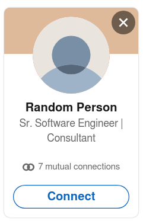

# Linkibot - A small automation tool.

##### How it works?




This is a random person, he has a title with **Sr. Software Engineer | Consultant**

Linkibot checks the persons title, if you put the **sr** keyword in that keywords list, it will send an invite to him. If you put **engineer** to the keywords list, it will send an invite to him. 

It's that easy. 


## Getting started 

#### Installation with PIP

```code
git clone https://github.com/ycd/linkibot
cd linkibot
pip install .
```

#### Usage

```python
from linkibot import Linkibot

bot = Linkibot("example@email.com", "password")

bot.keywords = ["put", "your", "keywords", "here"]

bot.run()
```


## License
---

Apache 2.0. See [LICENSE](https://github.com/ycd/linkibot/blob/master/LICENSE)
